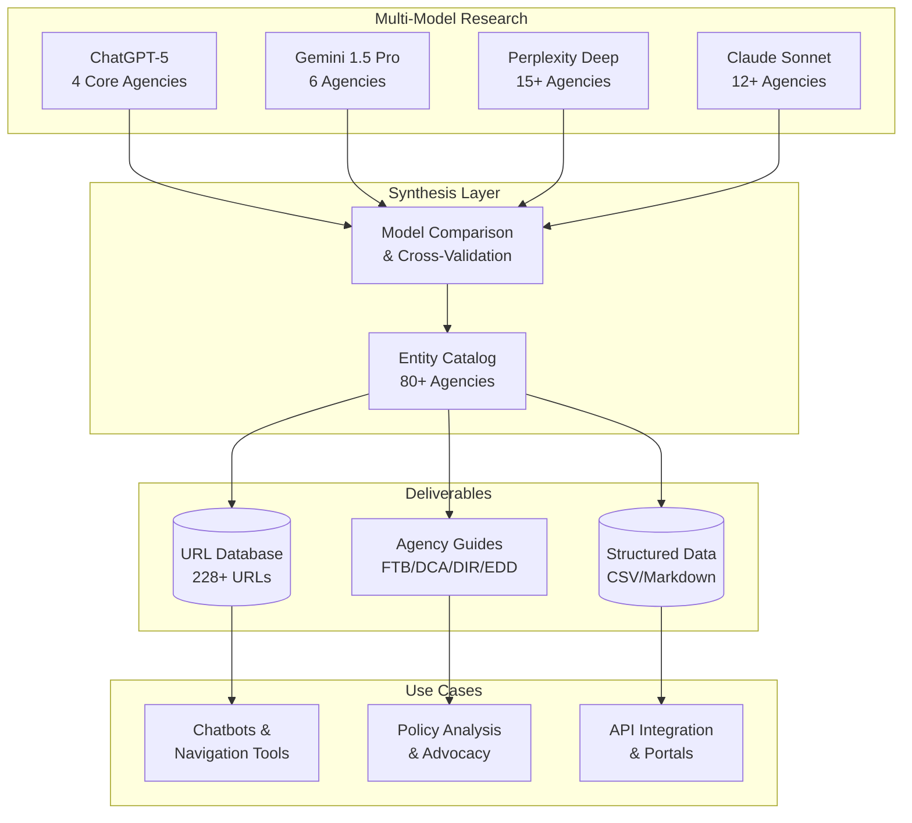

# BizAssessment

**Comprehensive research repository mapping California's business licensing ecosystem to identify AI-driven modernization opportunities.**

> **TL;DR**: Research mapping California's 80+ business licensing agencies to identify AI modernization opportunities. Includes 228+ validated URLs across 83 agencies, simulated stakeholder interviews from 4 AI models, and structured data for chatbot/navigation tool integration.

## Overview

This directory contains systematic research documenting California's state-level business formation, licensing, and regulatory environment. The research combines simulated stakeholder interviews, regulatory analysis, cross-agency mapping, and a comprehensive URL database to surface operational pain points and high-impact opportunities for AI-enabled process improvements.

The research was conducted using multiple advanced AI models (ChatGPT, Claude Sonnet, Gemini, Perplexity Deep Research, and Claude Opus 4.5) to ensure comprehensive coverage and diverse analytical perspectives on California's complex 80+ agency ecosystem.

## Table of Contents

- [Overview](#overview)
- [Repository Structure](#repository-structure)
- [URL Database](#comprehensive-url-database-december-2025)
- [Research Objectives](#research-objectives)
- [Key Findings](#key-findings)
- [Key Documents](#key-documents)
- [AI Opportunity Areas](#ai-opportunity-areas)
- [Use Cases](#use-cases)
- [Research Methodology](#research-methodology)

## Repository Structure

```
BizAssessment/
├── README.md
├── CA_Business_Licensing_URLs.xlsx              # Comprehensive URL database (228+ URLs)
├── CA_Business_Licensing_URLs_Documentation.md  # Database documentation for AI agents
├── Initial Assessment/
│   ├── BizInterviews_CGPT5_1.md                 # ChatGPT-5 analysis (4 core agencies)
│   ├── BizInterviews_Gemini3P.md                # Gemini 1.5 Pro research (6 agencies)
│   ├── BizInterviews_PerplexDeep.md             # Perplexity research (15+ agencies)
│   ├── BizInterviews_Sonnet4_5.md               # Claude Sonnet analysis (12+ agencies)
│   └── model_comparison.md                       # Comparative evaluation of model outputs
├── BizInterviews_SmallBiz_Def.md                # Small business definition framework
├── ca_business_licensing_entities_clean.csv     # Structured agency data (CSV)
├── ca_business_licensing_entities_clean.md      # Entity landscape summary
├── CA_FTB_URL_Comprehensive_Guide.md            # FTB URL reference
├── CA_DCA_Comprehensive_URL_Guide.md            # DCA boards/bureaus URL reference
├── CA_DIR_Comprehensive_URL_Guide.md            # DIR URL reference
├── california-edd-employer-resources.md         # EDD URL reference
└── create_url_database.py                       # Utility: generates XLSX from research data
```

**Quick Links:**
- [URL Database (Excel)](CA_Business_Licensing_URLs.xlsx) — 228+ URLs across 83 agencies
- [URL Documentation](CA_Business_Licensing_URLs_Documentation.md) — AI agent usage guide
- [Entity Catalog (CSV)](ca_business_licensing_entities_clean.csv) — Structured data for integration
- [Small Business Definitions](BizInterviews_SmallBiz_Def.md) — 26+ statutory definitions reconciled

## Research Architecture



## Comprehensive URL Database (December 2025)

The repository includes a **machine-readable URL database** for AI agent integration:

### CA_Business_Licensing_URLs.xlsx

A comprehensive Excel database containing **228+ validated URLs** across **83 California state departments, boards, and agencies** involved in business licensing.

| Metric | Value |
|--------|-------|
| Total URLs | 228+ |
| Departments/Agencies | 83 |
| URL Categories | 12 (Portal, Application, Search, Forms, Fees, Guide, Help, Contact, etc.) |
| DCA Boards/Bureaus | 38 |
| Regional Water Boards | 9 |
| Local Air Districts | 26 (major districts) |

**Excel Worksheets:**
1. **CA Business Licensing URLs** — Main database with filtering
2. **Summary by Department** — URL counts per agency
3. **Summary by Category** — Distribution by type
4. **About** — Metadata and usage notes

### CA_Business_Licensing_URLs_Documentation.md

Companion documentation providing:
- Database structure explanation
- Department coverage matrix
- AI agent usage guidelines
- Common user journey mappings
- Key contact phone numbers
- Acronym reference

---

## Research Objectives

1. **Ecosystem Mapping**: Identify and document every California state department involved in business formation, licensing, permitting, and compliance
2. **Pain Point Discovery**: Surface operational bottlenecks, manual workflows, and user frustration patterns across both agency staff and business users
3. **AI Opportunity Analysis**: Identify high-leverage intervention points where agentic AI can reduce administrative burden, improve process clarity, and streamline compliance
4. **Cross-Agency Dependencies**: Map data flows, redundant information requests, and coordination gaps between agencies
5. **URL Reference System**: Build a comprehensive, validated URL database for AI agents to provide accurate resource links

## Key Findings

### Agencies Covered

The research spans **80+ state entities** organized across five functional categories:

**Core Formation & Tax Registration** (4 agencies)
- Secretary of State (SOS) - Business Programs Division
- Franchise Tax Board (FTB)
- Employment Development Department (EDD)
- California Department of Tax and Fee Administration (CDTFA)

**Professional & Occupational Licensing** (38 boards/bureaus under DCA umbrella)
- Department of Consumer Affairs (DCA) coordination body
- Contractors State License Board (CSLB)
- Board of Registered Nursing (BRN)
- Medical Board of California
- California Board of Accountancy (CBA)
- Bureau of Automotive Repair (BAR)
- Board of Pharmacy
- Board of Barbering and Cosmetology
- Bureau of Security and Investigative Services (BSIS)
- *...and 29 additional boards/bureaus (see URL database)*

**Industry-Specific Regulators** (7 agencies)
- Department of Alcoholic Beverage Control (ABC)
- Department of Cannabis Control (DCC)
- Department of Real Estate (DRE)
- California Department of Insurance (CDI)
- California Department of Food and Agriculture (CDFA)
- Department of Industrial Relations (DIR)
- California Air Resources Board (CARB)

**Environmental & Safety Agencies** (45+ entities)
- State Water Resources Control Board
- 9 Regional Water Quality Control Boards
- Department of Toxic Substances Control (DTSC)
- California Air Resources Board (CARB)
- 35 Local Air Quality Management Districts
- Cal/OSHA (DIR division)

**Coordination & Support Entities** (3 offices)
- Governor's Office of Business and Economic Development (GO-Biz)
- California Office of the Small Business Advocate (CalOSBA)
- CalGOLD permit finder platform

### Cross-Cutting Pain Points

**For Businesses:**
- Discovery challenges: Businesses often learn about requirements only after penalties or compliance failures
- Portal fragmentation: Each agency maintains separate systems with unique login credentials, interfaces, and workflows
- Documentation redundancy: The same business information (ownership, addresses, financial data) must be re-entered across 10+ systems
- Status opacity: Limited real-time visibility into application status, processing timelines, or next steps
- Regulatory complexity: Overlapping jurisdiction between state, local, and federal agencies creates confusion

**For Agency Staff:**
- Manual verification workflows: Staff spend significant time cross-referencing data between systems
- Legacy system constraints: Many agencies operate on decades-old technology platforms with limited API capabilities
- Inconsistent data standards: Lack of common identifiers or data formats complicates inter-agency coordination
- Volume vs. capacity mismatches: Application backlogs reach 10-12 weeks for high-demand licenses (e.g., nursing, contractors)

## Key Documents

### Initial Assessment Folder

Contains four parallel research efforts, each generated by a different AI model to ensure comprehensive coverage:

| Document | Model | Agencies | Key Strength | Use Case |
|----------|-------|----------|--------------|----------|
| **BizInterviews_CGPT5_1.md** | ChatGPT-5 | 4 core | Concise, sharp interview questions | Quick overview of core agencies |
| **BizInterviews_Gemini3P.md** | Gemini 1.5 Pro | 6 | Balanced narrative | Mid-level stakeholder briefings |
| **BizInterviews_PerplexDeep.md** | Perplexity | **15+** | **Broadest scope** | Complete ecosystem mapping |
| **BizInterviews_Sonnet4_5.md** | Claude Sonnet | 12+ | **Deepest detail** | Detailed interview preparation |

**model_comparison.md** provides a structured evaluation of each model's output quality, scope, and analytical depth.

### Supporting Reference Documents

**BizInterviews_SmallBiz_Def.md**
- Comprehensive analysis of California's **26+ statutory definitions** of "small business"
- Reconciles Government Code § 14837 (procurement certification) with § 11342.610 (rulemaking impact)
- Compares state thresholds to federal SBA standards
- Provides recommended unified definition for cross-agency digital services

**ca_business_licensing_entities_clean.md / .csv**
- Structured catalog of all state licensing entities
- Documents known challenges and pain points for each agency
- Available in both human-readable markdown and machine-readable CSV formats
- Designed for integration into navigation tools, chatbots, or requirement engines

## AI Opportunity Areas

Research identified six high-impact intervention categories:

1. **Intelligent Requirement Discovery**
   - Dynamic questionnaire engines that identify applicable licenses based on business characteristics
   - Proactive alerts about upcoming renewals, continuing education, or compliance deadlines
   - Plain-language explanations of technical regulatory requirements

2. **Cross-Agency Data Harmonization**
   - Single business profile shared across agencies via secure API infrastructure
   - Automated pre-filling of common data elements (ownership, addresses, financial info)
   - Real-time verification of prerequisite licenses (e.g., checking DCC approvals before issuing local permits)

3. **Document Processing & Verification**
   - AI-assisted extraction of key fields from uploaded documents (diplomas, experience certificates, financial statements)
   - Automated verification against trusted databases (NCLEX results, university transcripts)
   - Intelligent routing of applications based on complexity and risk profiles

4. **Application Status Transparency**
   - Unified status dashboard aggregating data from multiple agency systems
   - Predictive timeline estimates based on historical processing patterns
   - Proactive notifications about missing documentation or next steps

5. **Regulatory Guidance & Navigation**
   - Conversational AI assistants answering common procedural questions
   - Step-by-step wizards guiding users through complex multi-agency processes (e.g., cannabis licensing requiring local → CEQA → DCC → CDTFA coordination)
   - Personalized compliance checklists based on business type and location

6. **Analytics & Process Optimization**
   - Real-time dashboards showing application volumes, processing times, and bottleneck identification
   - Predictive models flagging applications likely to require additional review
   - A/B testing frameworks for evaluating process changes or communication strategies

## Use Cases

This research supports multiple stakeholder needs:

**Policy Makers**
- Identify statutory or regulatory barriers to streamlining
- Quantify the administrative burden on small businesses
- Prioritize inter-agency coordination projects

**Technology Teams**
- Scope API integrations and data-sharing projects
- Design unified business portals or "digital front doors"
- Build intelligent routing and recommendation engines

**Business Advocates**
- Document specific pain points with concrete examples
- Develop training materials and support resources
- Advocate for policy changes with data-backed evidence

**Agency Leadership**
- Benchmark processing times and service quality
- Identify internal process improvement opportunities
- Plan digital transformation roadmaps

## Research Methodology

### Model Selection Rationale

Four models were selected to balance breadth and depth:
- **ChatGPT-5**: Rapid synthesis and question formulation
- **Gemini 1.5 Pro**: Multi-source integration and contextual reasoning
- **Perplexity Deep Research**: Real-time web search and source diversity (60+ citations in small business definition research)
- **Claude Sonnet**: Long-context analysis and nuanced interview question design

### Research Process

1. **Landscape Mapping**: Each model was prompted to identify all state agencies involved in business licensing
2. **Stakeholder Simulation**: Models generated realistic interview guides for each agency, focusing on:
   - Common user pain points and complaint patterns
   - Manual workflows consuming significant staff time
   - Cross-agency coordination challenges
   - Opportunities for AI-enabled automation
3. **Cross-Validation**: Outputs were compared in `model_comparison.md` to identify coverage gaps and reconcile conflicting information
4. **Structured Output**: Final entity catalog synthesized into standardized CSV and markdown formats for downstream use

---

**Last Updated**: December 2025 | **Status**: Active Research
