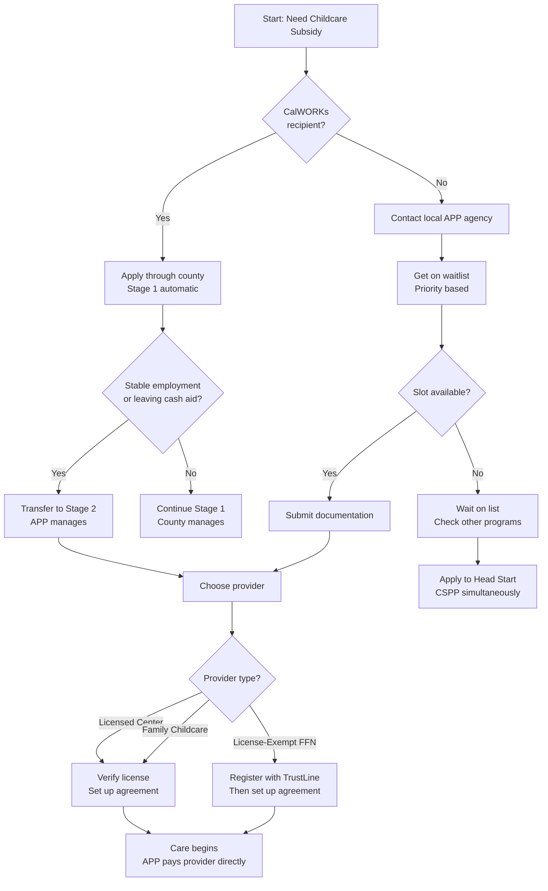

# Alternative Payment Program (APP) Overview

**Purpose:** Understand how California's voucher-based childcare subsidy system works and how to access it.

---

## What Is APP?

The **Alternative Payment Program (APP)** is California's voucher-based childcare subsidy system that provides financial assistance to low-income families with children under 13. Unlike direct-contracted childcare centers, APP gives families the flexibility to choose their own providers.

```
┌─────────────────────────────────────────────────────────────┐
│                    APP SUBSIDY FLOW                         │
├─────────────────────────────────────────────────────────────┤
│  Family applies → APP Agency verifies → Family chooses →    │
│  Provider approved → Agency pays provider directly          │
└─────────────────────────────────────────────────────────────┘
```

### Key Features

| Feature | Description |
|---------|-------------|
| **Parent choice** | Families select their own childcare provider |
| **Voucher-based** | Subsidies follow the child, not a specific facility |
| **Flexible hours** | Covers full-time, part-time, evenings, weekends |
| **Multiple care types** | Licensed centers, family child care, FFN (relatives/neighbors) |
| **Direct payment** | Agency pays provider directly (not cash to families) |

---

## APP vs. Direct-Contracted Care (Title 5)

| Aspect | APP (Voucher) | Title 5 (Direct Contract) |
|--------|---------------|--------------------------|
| **How it works** | Family chooses provider, agency reimburses | Family enrolls at specific contracted center |
| **Provider types** | Any approved provider | Only contracted facilities |
| **Flexibility** | High — any schedule, any location | Limited to program hours/slots |
| **Who administers** | APP contractor agencies | Center directly |
| **Examples** | Stage 2/3 CalWORKs, General APP | Head Start, CSPP at specific sites |

**When to use APP:**
- You need care outside traditional hours (nights, weekends)
- You prefer a family child care home or relative
- Your preferred center isn't a Title 5 contractor
- You need care in multiple locations

---

## What APP Covers

### Types of Care

| Care Type | Covered? | Notes |
|-----------|----------|-------|
| Licensed child care centers | ✅ Yes | Must be Title 22 or Title 5 licensed |
| Licensed family child care homes | ✅ Yes | Small or large FCCHs |
| License-exempt (FFN) | ✅ Yes | Relatives, friends, neighbors — TrustLine required |
| In-home care (your home) | ✅ Yes | Provider comes to your home |
| Before/after school care | ✅ Yes | For school-age children |
| Summer programs | ✅ Yes | During school breaks |
| Private school tuition | ❌ No | Before/after school wrap-around only |

### Children Served

- **Ages:** Birth through 12 years (or 21 with disabilities)
- **Multiple children:** Same family can use different providers
- **Split care:** Children can attend different programs with approval

---

## CalWORKs Child Care Stages

APP agencies administer **Stages 2 and 3** of CalWORKs child care:

```
┌──────────────┐     ┌──────────────┐     ┌──────────────┐
│   STAGE 1    │ ──► │   STAGE 2    │ ──► │   STAGE 3    │
│  (Cash Aid)  │     │(Transitional)│     │  (Ongoing)   │
├──────────────┤     ├──────────────┤     ├──────────────┤
│ County runs  │     │  APP runs    │     │  APP runs    │
│ Entitlement  │     │ Entitlement  │     │Fund-dependent│
│ With cash    │     │ Off cash     │     │ Long-term    │
└──────────────┘     └──────────────┘     └──────────────┘
```

| Stage | Administrator | Eligibility | Status |
|-------|---------------|-------------|--------|
| **Stage 1** | County welfare department | Receiving CalWORKs cash aid | Entitlement |
| **Stage 2** | APP contractor | Off cash aid, transitioning | Entitlement |
| **Stage 3** | APP contractor | Former CalWORKs, income-eligible | Fund-dependent |

### Stage Transitions

- **Stage 1 → Stage 2:** When family stabilizes or leaves cash aid
- **Stage 2 → Stage 3:** When funding is available and family remains eligible
- **Key point:** Child care continues even after cash aid ends

---

## General APP (Non-CalWORKs)

Families not on CalWORKs can also qualify for APP subsidies based on:

### Income Eligibility

| Threshold | Meaning |
|-----------|---------|
| **Initial eligibility** | Family income at or below 85% SMI |
| **Ongoing eligibility** | Can remain until income exceeds 85% SMI |
| **Fee exemption** | No family fees if income ≤75% SMI |

*See [CCDF_Eligibility_Matrix.md](../CCDF/CCDF_Eligibility_Matrix.md) for current income limits.*

### Need Requirements

Must have a qualifying need for childcare:
- Employment (including self-employment, gig work)
- Job search (time-limited)
- Education or training
- Parental incapacity (medical documentation)
- Child Protective Services (CPS) involvement
- Homelessness
- Seeking permanent housing

---

## How to Apply for APP

### Step 1: Find Your Local APP Agency

APP agencies are contracted by county. Find yours:
- Contact your local **CCR&R** (Child Care Resource & Referral)
- Call **CDSS Child Care Hotline:** 1-800-KIDS-793
- Search [Find Child Care](https://rrnetwork.org/family-services/find-child-care)

### Step 2: Get on the Waitlist

Most APP agencies maintain waitlists due to high demand:

| Priority Level | Who Qualifies |
|----------------|---------------|
| **Priority 1** | Children with CPS referral, neglected/abused, homeless, foster |
| **Priority 2** | Children with disabilities |
| **Priority 3** | Income-ranked (lowest income first) |

**Tip:** Apply to multiple waitlists if your county has multiple contractors.

### Step 3: Submit Documentation

When your turn comes, you'll need:

| Document | Purpose |
|----------|---------|
| Proof of income | Pay stubs, tax returns, self-employment records |
| Proof of need | Employment verification, school enrollment, medical |
| Child's age verification | Birth certificate, immunization records |
| Residency | Utility bill, lease, ID |

### Step 4: Choose Your Provider

Once approved, you can select any:
- Licensed center or family child care home
- License-exempt provider (must register with TrustLine)
- In-home caregiver

The APP agency will:
1. Verify provider meets requirements
2. Set up provider agreement
3. Begin payments directly to provider

### Application Process Flowchart



---

## How Payments Work

### Regional Market Rate (RMR)

APP subsidies are capped at the **Regional Market Rate** — the maximum amount paid based on:
- Geographic region (rates vary by county)
- Type of care (center vs. family child care)
- Child's age (infant care costs more)
- Hours of care (full-time vs. part-time)

### Payment Flow

```
Family receives care → Provider submits attendance →
APP agency verifies → Payment sent to provider
```

### Family Fees (Co-Payments)

- Families above 75% SMI pay a portion based on income
- Families at or below 75% SMI pay **no family fees**
- Fees are paid directly to the provider

---

## APP vs. CAPP

You may see both terms used:

| Term | Meaning |
|------|---------|
| **APP** | General Alternative Payment Program (non-CalWORKs or general use) |
| **CAPP** | CalWORKs Alternative Payment Program (Stages 2 & 3 specifically) |

In practice, the same agencies often administer both, and families may move between programs based on their CalWORKs status.

---

## Finding Your APP Agency

APP agencies are contracted at the county level. Common contractor types:
- **County Offices of Education** (COE)
- **Non-profit organizations** (community action agencies, childcare councils)
- **School districts**
- **CCR&R agencies** (often provide both referral and APP services)

See [APP_Directory.csv](APP_Directory.csv) for a list of contractors by county.

---

## Troubleshooting

### "My provider doesn't accept vouchers"

Some providers choose not to accept subsidies due to paperwork or rate limits. Options:
- Ask if they'll reconsider (some agencies help with enrollment)
- Find an accepting provider through your CCR&R
- Consider family child care homes (often more flexible)

### "I'm on a waitlist — how long?"

Wait times vary dramatically by county:
- High-demand areas (LA, Bay Area): 6 months to 2+ years
- Other areas: Weeks to months

**Strategies:**
- Apply to multiple waitlists
- Update your application regularly
- Apply for other programs (Head Start, CSPP) simultaneously
- Ask about emergency childcare if crisis situation

### "My income changed — will I lose care?"

- Income increases don't immediately disqualify you
- You remain eligible until income exceeds 85% SMI
- Report changes promptly to avoid overpayments

---

## Key Resources

| Resource | Contact |
|----------|---------|
| **Find local APP agency** | [Find Child Care](https://rrnetwork.org/family-services/find-child-care) |
| **CDSS Child Care Programs** | [cdss.ca.gov/inforesources/child-care-and-development](https://www.cdss.ca.gov/inforesources/child-care-and-development) |
| **CCR&R Directory** | [rrnetwork.org](https://rrnetwork.org/about/r-r-directory) |
| **CalWORKs Child Care Info** | [cdss.ca.gov/inforesources/calworks-child-care](https://www.cdss.ca.gov/inforesources/calworks-child-care) |

---

## Sources

- [CDSS CalWORKs Child Care Programs](https://www.cdss.ca.gov/inforesources/calworks-child-care/subsidized-programs)
- [Child Development Resources (CDR)](https://cdrv.org/cdr-programs-and-services/california-work-opportunity-and-responsibility-to-kids-calworks-alternative-payment-programs/)
- [Riverside County APP](https://www.rcoe.us/departments/early-education-services/early-care-and-education/alternative-payment-program-calworks-stage-2-and-calworks-stage-3)
- [Options for Learning](https://www.optionsforlearning.org/apps/pages/index.jsp?uREC_ID=2100182&type=d&pREC_ID=2330217)

---

*Last updated: December 2025*
