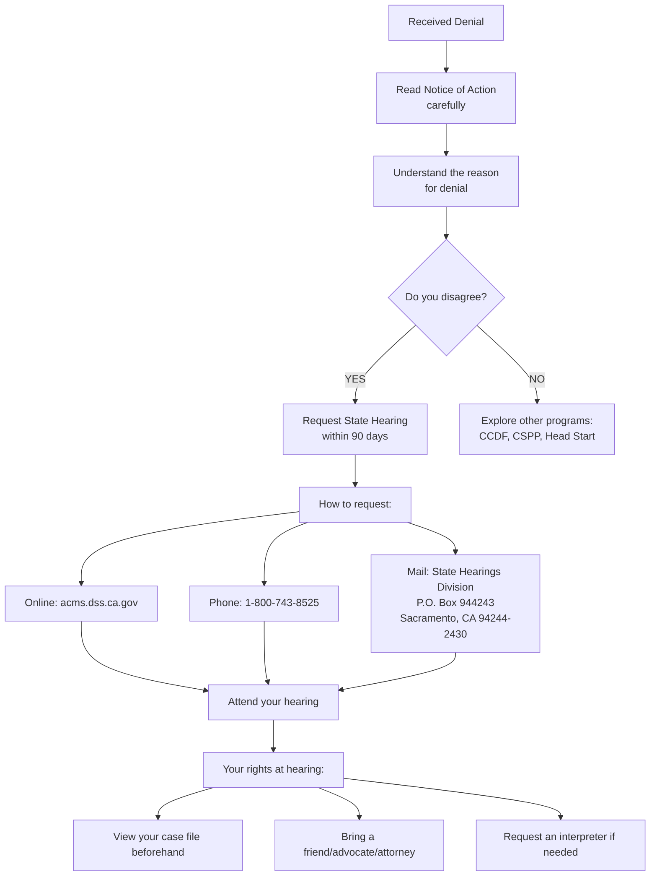
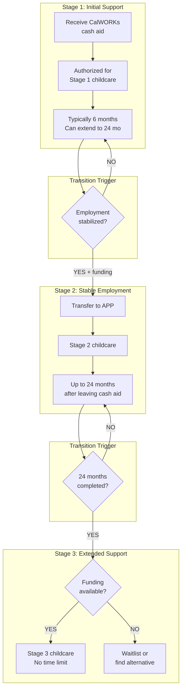

# CalWORKs Child Care Application Flowchart

**Purpose:** Step-by-step guide to applying for CalWORKs childcare
**Audience:** Parents, case workers, navigators

---

## Application Process Overview

```mermaid
flowchart TD
    START([Need Childcare?]) --> Q1{Currently receiving<br/>CalWORKs cash aid?}

    Q1 -->|YES| A1[Request childcare<br/>from your caseworker]
    Q1 -->|NO| Q2{Received CalWORKs<br/>in last 24 months?}

    Q2 -->|YES| A2[Contact your county<br/>welfare office or APP]
    Q2 -->|NO| ALT[Not eligible for CalWORKs<br/>Try CCDF, CSPP, or Head Start]

    A1 --> FORM[Complete Form CCP 7<br/>CalWORKs Child Care Request]
    A2 --> FORM

    FORM --> DOCS[Gather Required Documents]

    DOCS --> PROVIDER[Select Your Provider]

    PROVIDER --> Q3{Provider type?}

    Q3 -->|Licensed Center| LC[Verify license with CDSS]
    Q3 -->|Family Child Care| FCC[Verify license with CDSS]
    Q3 -->|Relative| REL[Provider must be 18+<br/>No TrustLine needed]
    Q3 -->|Non-Relative| TRUST[Provider must register<br/>with TrustLine]

    LC --> SUBMIT
    FCC --> SUBMIT
    REL --> SUBMIT
    TRUST --> SUBMIT

    SUBMIT[Submit application<br/>to county/APP] --> WAIT[Wait for processing<br/>Up to 45 days]

    WAIT --> Q4{Approved?}

    Q4 -->|YES| START_CARE[🎉 Start childcare!<br/>Provider gets paid directly]
    Q4 -->|NO| APPEAL[Request State Hearing<br/>within 90 days]

    APPEAL --> HEARING[State Hearings Division<br/>1-800-743-8525]
```



---

## Step-by-Step Application Guide

### Step 1: Determine Your Pathway

| Your Situation | Where to Apply | Expected Stage |
|----------------|----------------|----------------|
| Currently on CalWORKs cash aid | County welfare office | Stage 1 |
| Left CalWORKs < 6 months ago | County welfare office | Stage 1 |
| Left CalWORKs 6-24 months ago | Alternative Payment Program | Stage 2 |
| Left CalWORKs > 24 months ago | Alternative Payment Program | Stage 3 (if funding available) |

### Step 2: Gather Documentation

**Required for ALL applicants:**

```
□ Proof of identity (driver's license, ID, passport)
□ Social Security cards for all family members
□ Birth certificates for children needing care
□ Proof of residence (utility bill, lease, mail)
□ Income verification (pay stubs, tax returns)
```

**If working:**
```
□ Employer name, address, phone number
□ Work schedule (days and hours)
□ Pay stubs from last 30-60 days
```

**If in school/training:**
```
□ School enrollment verification
□ Class schedule
□ Expected graduation/completion date
```

**If self-employed:**
```
□ Tax return from prior year
□ Profit & loss statement
□ Business license (if applicable)
```

### Step 3: Choose Your Provider

```mermaid
flowchart LR
    CHOOSE[Choose Provider] --> TYPE{What type?}

    TYPE --> CENTER[Licensed Center]
    TYPE --> FCC[Family Child Care Home]
    TYPE --> EXEMPT[License-Exempt]

    CENTER --> CHECK1[Check license at<br/>cdss.ca.gov/childcare]
    FCC --> CHECK2[Check license at<br/>cdss.ca.gov/childcare]

    EXEMPT --> Q{Related to child?}
    Q -->|YES| OK1[✅ No TrustLine needed<br/>Must be 18+]
    Q -->|NO| TRUST[Must register with<br/>TrustLine first]

    TRUST --> TRUST_STEPS[1. Call 1-800-822-8490<br/>2. Get fingerprinted<br/>3. Wait for clearance]
```



### Step 4: Complete the Application

**Form CCP 7: CalWORKs Child Care Request**

This form captures:
- Child's information (name, DOB, any special needs)
- Provider information (name, address, license #)
- Care schedule (days, hours needed)
- Parent signature

**Where to get the form:**
- Your county welfare office
- Download from [CDSS Forms](https://www.cdss.ca.gov/inforesources/forms-brochures/forms-by-program)
- Your Alternative Payment Program office

### Step 5: Submit and Wait

| Timeline | What Happens |
|----------|--------------|
| Day 1 | Application received |
| Days 1-10 | Documents reviewed, interview scheduled |
| Days 10-30 | Eligibility determination |
| Day 45 | **Deadline** for decision |
| Day 45+ | Appeal window opens if denied |

**Emergency?** Request **Immediate Need** assistance:
- Can be processed in **3 working days**
- Provides temporary help while full application processes
- Ask your caseworker specifically about this option

### Step 6: If Approved

```
✅ You'll receive a Notice of Action showing:
   - Your eligibility dates
   - Your provider's approved reimbursement rate
   - Your family fee amount (if any)
   - Your assigned caseworker/specialist

✅ Your provider will receive:
   - Authorization to provide care
   - Reimbursement instructions
   - Attendance reporting requirements
```

### Step 7: If Denied

**You have the right to appeal!**



---

## Stage Transition Flowchart



---

## Quick Reference: Key Contacts

| Need | Contact |
|------|---------|
| **Apply for CalWORKs** | Your county Human Services Agency |
| **Find your county office** | [CDSS County Office Directory](https://www.cdss.ca.gov/county-offices) |
| **Stage 2/3 questions** | Your local Alternative Payment Program |
| **Find your local APP** | [CDE Contractor List](https://www.cde.ca.gov/sp/cd/re/cdcontractorinfo.asp) |
| **Appeal a decision** | 1-800-743-8525 |
| **TrustLine registration** | 1-800-822-8490 or www.TrustLine.org |
| **Online application** | www.benefitscal.com |

---

## Processing Timeline Expectations

```
Week 1    Week 2    Week 3    Week 4    Week 5    Week 6
|---------|---------|---------|---------|---------|
[Submit]  [Interview]         [Decision]  [Start Care]
   ↓          ↓                   ↓            ↓
 Day 1    Day 5-10            Day 30-45    Day 45+

EMERGENCY PATH:
[Submit] → [Immediate Need Request] → [3 days] → [Temp Approval]
```

---

*This flowchart is for guidance only. Actual processes may vary by county. Always confirm with your local welfare office or Alternative Payment Program.*
