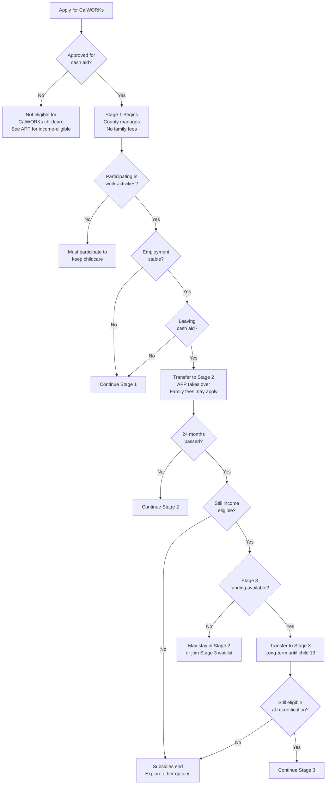

# CalWORKs Child Care Program Overview

**Last Updated:** December 2025
**Source:** CDSS, Perplexity Deep Research (60 citations)
**Audience:** Parents seeking subsidized childcare in California

---

## What is CalWORKs Child Care?

CalWORKs Child Care is California's primary childcare subsidy program for families receiving welfare assistance or transitioning to work. It operates in **three stages**, each designed for different points in a family's journey to self-sufficiency.

| Stage | Who It Serves | Entitlement? | Administered By |
|-------|---------------|--------------|-----------------|
| **Stage 1** | Families newly receiving CalWORKs cash aid | ✅ Yes | County welfare departments |
| **Stage 2** | Families with stable employment or transitioning off cash aid | ✅ Yes | Alternative Payment Programs (APPs) |
| **Stage 3** | Former CalWORKs families after 24 months off cash aid | ❌ Fund-dependent | Alternative Payment Programs (APPs) |

---

## Stage 1: Getting Started

### Who Qualifies
- Currently receiving CalWORKs cash assistance
- Participating in welfare-to-work activities (job search, training, education)
- Former CalWORKs recipients within 24 months (if still working)

### Key Facts
- **Duration:** Typically 6 months, can extend up to 24 months
- **Child ages:** Birth through 12 (21 for children with disabilities)
- **Family fees:** None while receiving cash aid
- **Provider choice:** Licensed centers, family childcare, or license-exempt relatives/friends

### How to Apply
1. Request childcare when you apply for CalWORKs cash aid
2. Complete form **CCP 7** (CalWORKs Child Care Request)
3. Select your provider
4. No separate application needed — it's part of your CalWORKs case

---

## Stage 2: Stable Employment

### Transition from Stage 1
You move to Stage 2 when:
- Your county determines your work situation is "stable"
- You're transitioning off cash aid
- Stage 2 funding is available in your county

### Key Facts
- **Duration:** Up to 24 months after leaving cash aid
- **Income limit:** 85% of State Median Income (see eligibility matrix)
- **Family fees:** May apply based on income (see fee schedule)
- **Entitlement:** Yes — you're guaranteed services if eligible

### Important Change
> ⚠️ **The "24 months off cash aid" rule has been modified.** If Stage 3 has a waitlist, you can stay in Stage 2 longer. Time in Stage 1 after leaving cash aid counts toward your 24-month total.

---

## Stage 3: Extended Support

### Who Qualifies
- Completed 24 months in Stage 1/2 after leaving cash aid
- Income remains at or below 85% SMI
- Still need childcare for work

### Key Facts
- **Duration:** No time limit (as long as you remain eligible)
- **Income limit:** 85% of State Median Income
- **Family fees:** Based on income
- **Fund-dependent:** NOT guaranteed — depends on funding availability

### ⚠️ Warning: Stage 3 is Not Guaranteed
Unlike Stages 1 and 2, Stage 3 depends on available funding. If funding runs out:
- You may be placed on a waiting list
- Your childcare may be discontinued
- You'll need to find alternative arrangements

**Recommendation:** Before your Stage 2 ends, explore:
- California State Preschool Program (CSPP)
- Head Start / Early Head Start
- Private pay arrangements

---

## Income Eligibility (2025-26)

### Stage 1: Cash Aid Recipients
To receive CalWORKs cash aid, your income must be below the **Minimum Basic Standard of Adequate Care (MBSAC)**:

| Family Size | Monthly MBSAC |
|-------------|---------------|
| 1 | $853 |
| 2 | $1,401 |
| 3 | $1,736 |
| 4 | $2,063 |
| 5 | $2,350 |

### Stages 2 & 3: 85% State Median Income
Once off cash aid, you qualify as long as income stays below:

| Family Size | Monthly Limit | Annual Limit |
|-------------|---------------|--------------|
| 1-2 | $6,860 | $82,326 |
| 3 | $7,785 | $93,418 |
| 4 | $9,020 | $108,237 |
| 5 | $10,463 | $125,555 |
| 6 | $11,906 | $142,873 |
| 7+ | See full matrix | — |

---

## The Earned Income Disregard (Work Incentive)

CalWORKs is designed so that **work pays**. Here's how:

1. **First $600** of earnings is completely ignored
2. **50% of remaining earnings** is also ignored

### Example
Family earns $1,200/month:
- Minus $600 disregard = $600
- Minus 50% of $600 = $300
- **Countable income = $300** (not $1,200!)

This means you can earn significantly more than the MBSAC and still qualify for cash aid.

---

## Family Fees (Copays)

### Who Pays?
- **Stage 1 with cash aid:** No fees
- **Stage 2 & 3:** Fees based on income
- **Income below 75% SMI:** Exempt from fees

### 2025-26 Fee Schedule
Fees are capped at approximately **1% of adjusted monthly income** across all childcare programs. The exact amount depends on:
- Your adjusted monthly income
- Your family size
- Number of children in care

> 💡 **Tip:** You can request a fee reduction at any time if your income decreases. You don't have to wait for annual recertification.

---

## Child Age Limits

| Age Group | Eligible? | Notes |
|-----------|-----------|-------|
| Infants (0-12 mo) | ✅ Yes | Full-day care available |
| Toddlers (1-2) | ✅ Yes | Full-day care available |
| Preschool (3-5) | ✅ Yes | Full-day or part-day |
| School-age (6-12) | ✅ Yes | Preference for before/after school programs |
| Ages 11-12 | ✅ Yes | Strong preference for school-based care |
| Special needs (13-21) | ✅ Yes | Extended eligibility with documentation |

---

## Provider Options

You can choose any of these provider types:

| Provider Type | Licensed? | Notes |
|---------------|-----------|-------|
| **Child care center** | Yes | Must be licensed by CDSS |
| **Family child care home** | Yes | Small (up to 8 kids) or large (up to 14 kids) |
| **Before/after school program** | Varies | Often school-based |
| **Relative (grandparent, aunt, etc.)** | No | Must be 18+, may need TrustLine if unrelated |
| **Friend or neighbor** | No | Must be 18+, must register with TrustLine |

### TrustLine Registration
Non-relatives providing license-exempt care must register with TrustLine:
- **Phone:** 1-800-822-8490
- **Website:** www.TrustLine.org
- Requires fingerprinting and background check

---

## Recent Changes (2024-2025)

### What's New
1. **Updated family fee schedule** (July 2025) — may result in lower fees
2. **Provider rate increases** (SB 120/151) — better pay for childcare providers
3. **24-month Welfare-to-Work clock eliminated** — more flexibility for education/training
4. **Enrollment-based reimbursement** — providers get paid for enrolled slots, not just attendance

### Budget Allocation (FY 2025-26)
- **Stage 1:** $614 million (+1%)
- **Total CalWORKs:** $7+ billion
- **Federal TANF:** $3.7 billion annually

---

## Quick Reference: Key Contacts

| Need | Contact |
|------|---------|
| Apply for CalWORKs | Your county welfare department |
| Stage 2/3 questions | Your local Alternative Payment Program |
| Find your local APP | [CDSS Provider Search](https://www.cdss.ca.gov/inforesources/calworks-child-care) |
| Appeal a decision | State Hearings: 1-800-743-8525 |
| TrustLine registration | 1-800-822-8490 |

---

## Next Steps for Parents

1. **If you need CalWORKs cash aid:** Apply at your county welfare office
2. **If you already have CalWORKs:** Ask your worker about Stage 1 childcare
3. **If you're working and stable:** Ask about transitioning to Stage 2
4. **If Stage 2 is ending:** Apply for Stage 3 AND explore alternatives

---

## Stage Transition Flowchart

---

*Sources: CDSS.ca.gov, Sacramento County CalWORKs Fact Sheet (Jan 2025), LA County DPSS, California Child Care Resource & Referral Network*
