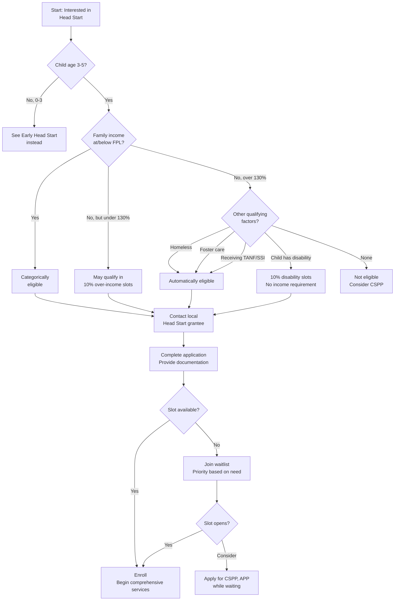

# Head Start Program Overview

**Purpose:** Understand how Head Start provides free, comprehensive early childhood services to low-income families in California.

---

## What Is Head Start?

**Head Start** is a federally funded program providing comprehensive early childhood development services for children ages 3-5 from low-income families. It's much more than childcare — it's a whole-family support system.

```
┌─────────────────────────────────────────────────────────────┐
│              HEAD START: MORE THAN CHILDCARE                │
├─────────────────────────────────────────────────────────────┤
│  EDUCATION    │  HEALTH        │  NUTRITION   │  FAMILY    │
│  School       │  Screenings    │  Meals &     │  Support   │
│  readiness    │  Dental care   │  snacks      │  services  │
│  curriculum   │  Mental health │  USDA        │  Job help  │
│               │  Vision/hearing│  standards   │  Resources │
└─────────────────────────────────────────────────────────────┘
```

### Quick Facts

| Feature | Details |
|---------|---------|
| **Ages served** | 3-5 years (until kindergarten entry) |
| **Cost to families** | **FREE** |
| **Funding** | Federal (U.S. Department of Health & Human Services) |
| **Focus** | School readiness + comprehensive family support |
| **California programs** | 100+ grantees statewide |

---

## Program Options

Head Start offers multiple delivery models to meet family needs:

### Center-Based Programs

| Option | Hours | Best For |
|--------|-------|----------|
| **Part-day** | ~3.5 hours/day | Families needing morning or afternoon care |
| **Full-day** | 6-10 hours/day | Working parents |
| **Extended day** | Available in some programs | Wraparound care needs |

### Home-Based Programs

| Component | Description |
|-----------|-------------|
| **Weekly home visits** | 1.5 hours with family in your home |
| **Monthly socialization** | Group activities at center |
| **Parent-focused** | Builds caregiving skills |
| **Best for** | Parents who want to be primary educator |

### Family Child Care Option

- Care provided in provider's licensed home
- Smaller group setting
- Home-like environment
- May include mixed ages

### Locally Designed Options

- Programs combine models based on community needs
- May blend center-based + home visits
- Varies by grantee

---

## Comprehensive Services

### Education Services

| Service | What's Included |
|---------|-----------------|
| **Curriculum** | Research-based, school-readiness focused |
| **Individualized learning** | Plans based on each child's development |
| **Parent involvement** | Home activities, volunteering opportunities |
| **Transition to kindergarten** | Planning and support |

### Health Services

| Service | What's Provided |
|---------|-----------------|
| **Developmental screenings** | Within 45 days of enrollment |
| **Medical exams** | Physical health assessment |
| **Dental care** | Exams, treatment, preventive care |
| **Vision & hearing** | Screenings and follow-up |
| **Mental health** | Support for children and families |
| **Immunizations** | Tracking and assistance |

### Nutrition Services

| Service | Details |
|---------|---------|
| **Meals & snacks** | Meet USDA nutritional standards |
| **Special diets** | Accommodations for allergies, religious, medical needs |
| **Nutrition education** | For parents and children |
| **Food assistance referrals** | CalFresh, WIC, food banks |

### Family Support Services

| Service | What's Offered |
|---------|----------------|
| **Goal-setting** | Education, employment, housing |
| **Resource connections** | Community services, benefits enrollment |
| **Parent education** | Child development, parenting skills |
| **Crisis support** | Emergency assistance referrals |
| **Parent leadership** | Policy Council, committees |

---

## Who Runs Head Start?

Head Start programs are operated by local **grantees** — organizations that receive federal grants to provide services. In California, grantees include:

| Organization Type | Examples |
|-------------------|----------|
| **County Offices of Education** | Riverside, Los Angeles, Sacramento |
| **School Districts** | Pasadena USD, LAUSD |
| **Community Action Agencies** | Community Action Partnership |
| **Non-profit Organizations** | Options for Learning, Crystal Stairs |
| **Tribal Organizations** | Serving Native American communities |

---

## Head Start vs. California State Preschool (CSPP)

| Feature | Head Start | CSPP |
|---------|------------|------|
| **Funding** | Federal (HHS) | State (CDE) |
| **Income limit** | Federal poverty level | Up to 100% SMI |
| **Ages** | 3-5 | 3-5 |
| **Services** | Comprehensive (health, family) | Education-focused |
| **Cost** | FREE | May have family fees |
| **Regulation** | Federal Head Start standards | Title 5 |

### Can You Combine Programs?

Yes! Many families access multiple services:
- **Head Start + wraparound care** from subsidized programs
- **Head Start at CSPP site** (blended programs)
- **Head Start + Regional Center services** for children with disabilities
- **Head Start + CalWORKs subsidies** for extended hours

---

## How to Find Head Start

### Step 1: Locate Programs Near You

- **Head Start California:** [headstartca.org](https://headstartca.org)
- **ECLKC Locator:** [eclkc.ohs.acf.hhs.gov](https://eclkc.ohs.acf.hhs.gov/center-locator)
- **Local CCR&R:** [rrnetwork.org](https://rrnetwork.org/about/r-r-directory)

### Step 2: Contact the Grantee

- Programs accept applications year-round
- Some have specific enrollment periods (typically spring)
- Ask about waitlist status and timing

### Step 3: Complete Application

Requirements typically include:
- Proof of income
- Child's birth certificate
- Immunization records
- Proof of address

### Enrollment Process Flowchart



---

## California Head Start Collaboration Office

The **California Head Start Collaboration Office** coordinates between Head Start programs and state agencies:

- **Agency:** California Department of Education
- **Phone:** 916-263-1718
- **Website:** [cde.ca.gov/sp/cd/re/hscollab.asp](https://www.cde.ca.gov/sp/cd/re/hscollab.asp)

---

## Key Resources

| Resource | Contact |
|----------|---------|
| **Head Start California** | [headstartca.org](https://headstartca.org) |
| **Federal Office of Head Start** | [acf.hhs.gov/ohs](https://www.acf.hhs.gov/ohs) |
| **Center Locator** | [eclkc.ohs.acf.hhs.gov/center-locator](https://eclkc.ohs.acf.hhs.gov/center-locator) |
| **Parent Info** | [childcare.gov](https://childcare.gov) |

---

## Sources

- [Office of Head Start](https://acf.gov/ohs/about/head-start)
- [Riverside County Office of Education Head Start](https://www.rcoe.us/departments/early-education-services/early-education-programs/head-start-and-early-head-start)
- [Options for Learning Head Start](https://www.optionsforlearning.org/apps/pages/index.jsp?uREC_ID=4331645&type=d&pREC_ID=2533847)
- [CA Head Start Collaboration Office](https://www.cde.ca.gov/sp/cd/re/hscollab.asp)

---

*Last updated: December 2025*
