# Visual Decision Trees

**Purpose:** Quick visual guides to help families navigate California childcare options based on their situation.

---

## How to Use These Decision Trees

1. Start at the top of the relevant tree
2. Follow the path based on your answers
3. Arrive at recommended programs/actions
4. Click through to detailed guides for next steps

---

## Decision Tree 1: Which Subsidy Program?

This tree helps determine which childcare subsidy programs you may qualify for.

---

## Decision Tree 2: Priority Population Status

This tree helps identify if you qualify for priority placement.

---

## Decision Tree 3: Provider Type Selection

This tree helps choose the right type of childcare provider.

---

## Decision Tree 4: CalWORKs Stage Transitions

This tree helps understand movement through CalWORKs childcare stages.

---

## Decision Tree 5: Special Needs Navigation

This tree helps families with children who have disabilities or delays.

```mermaid
flowchart TD
    A[Start: Child Has<br/>Special Needs] --> B{Child's Age?}

    B -->|0-3| C[Contact Regional Center<br/>for Early Start assessment]
    B -->|3+| D[Contact Regional Center<br/>AND school district]

    C --> E{Eligible for<br/>Early Start?}

    E -->|Yes| F[Get IFSP developed<br/>Services + childcare coordination]
    E -->|No| G{At risk or<br/>suspected delay?}

    G -->|Yes| H[Monitoring plan<br/>Re-evaluate as needed]
    G -->|No| I[Standard childcare<br/>pathways]

    D --> J{Eligible for<br/>Regional Center?}

    J -->|Yes| K[Get IPP developed<br/>May include childcare funding]
    J -->|No| L{Eligible for<br/>school IEP?}

    L -->|Yes| M[IEP services<br/>+ childcare separately]
    L -->|No| N[Standard childcare<br/>with accommodations]

    F --> O[Head Start 10% slots<br/>+ subsidized care options]
    K --> O
    M --> O

    click C "../09_User_Journeys/Journey_Special_Needs_Child.md"
    click D "../09_User_Journeys/Journey_Special_Needs_Child.md"
    click F "../09_User_Journeys/Journey_Special_Needs_Child.md"
    click K "../09_User_Journeys/Journey_Special_Needs_Child.md"
    click O "../01_Subsidies/Head_Start/Head_Start_Eligibility.md"
```

---

## Decision Tree 6: Cost Reduction Strategies

This tree helps identify ways to reduce childcare costs.

---

## Decision Tree 7: Emergency/Crisis Childcare

This tree helps families in urgent situations.

---

## Quick Reference: Which Tree to Use

| Your Situation | Start Here |
|----------------|------------|
| First time applying for subsidies | Tree 1: Which Subsidy Program |
| Wondering if you get priority | Tree 2: Priority Population Status |
| Choosing a provider type | Tree 3: Provider Type Selection |
| On CalWORKs, leaving cash aid | Tree 4: CalWORKs Stage Transitions |
| Child has disability or delay | Tree 5: Special Needs Navigation |
| Want to reduce costs | Tree 6: Cost Reduction Strategies |
| Urgent/emergency need | Tree 7: Emergency/Crisis Childcare |

---

## Notes on Using These Trees

1. **These are starting points** — always verify current eligibility requirements
2. **Multiple paths may apply** — you can often combine programs
3. **Timing matters** — apply early, especially during pregnancy
4. **Local variation** — your county may have additional programs
5. **Get help** — CCR&R agencies can walk you through options (free service)

---

*Related: [Planning Timeline](Planning_Timeline.md) | [User Journeys](../09_User_Journeys/) | [Common Mistakes FAQ](../04_Application_Processes/Common_Mistakes_FAQ.md)*

---

*Last updated: December 2025*
